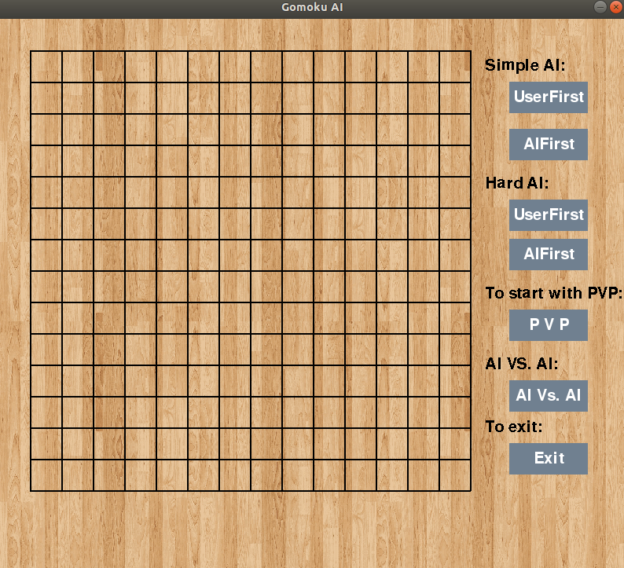
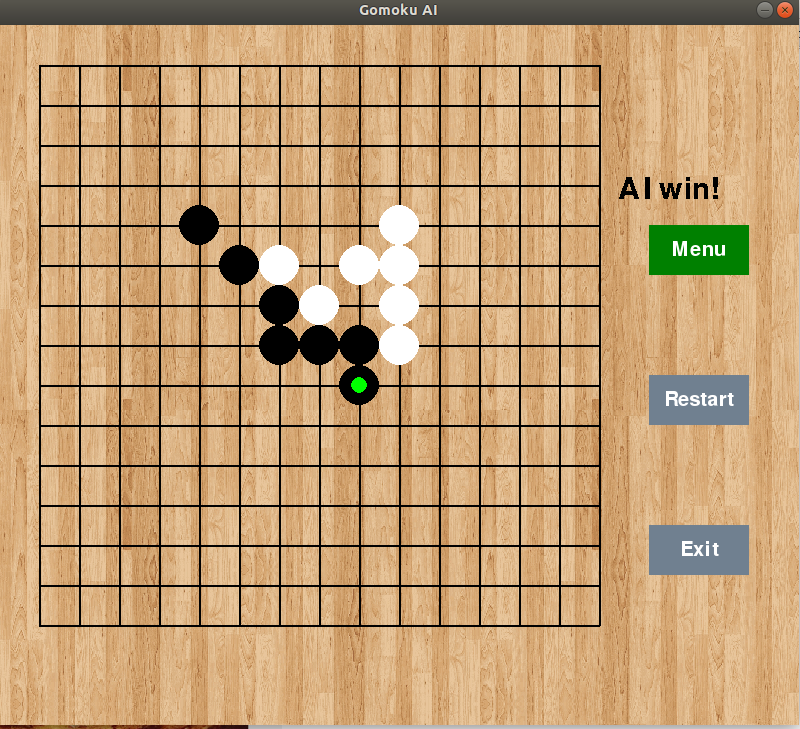

# Gomoku
Author: Freddie Yan

Goal: Try to implement the simpl AI in Gomoku.

Techniques to use: 

    Game tree search (make each board state as a node to be evaluated.)
    
    Min-Max algorithm use recursive to increase the depth.)
    
    Alpha-Beta cutting (improve the efficiency by cutting usless branch.)
    
    Heuristically Search (imporve the efficiency by cutting low possibility branch.)
    
 Current state:
 
    1.Depth of smart AI to consider a move is 3.
    
    2.I haven't beat the AI until this moment.
    
 Possible improvement:
 
    Use threads to make searches start concurrently.
    
 To open the game:
 
    1.Download the whold folder.
    
    2.Run game.py in any IDE with pygame installed.
    

 

